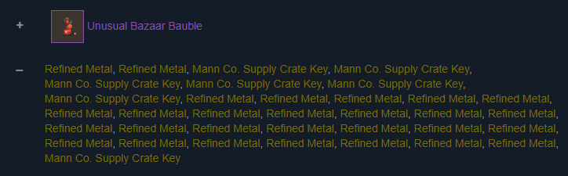

# tf2 key counter

Be lazy and count your trade items at [TF2 Key and Refined Counter Website](https://www.counter.tf/)

Now with TF2 Item Spelled Item Counts at [TF2 Spell Counts](https://counter.tf/all/render/index.html)

## About
This is a [Next.js](https://nextjs.org/) project bootstrapped with [`create-next-app`](https://github.com/vercel/next.js/tree/canary/packages/create-next-app).